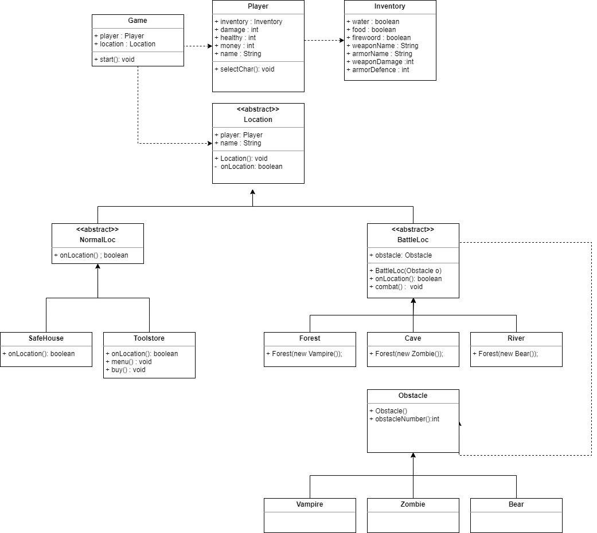

# Macera Oyunu

Java ile metin tabanlı bir macera oyunu yapıyoruz.

KARAKTERLER

| Karakter | ID  | Hasar | Sağlık | Para |
| :------- | :-: | :---: | :----: | :--: |
| Samuray  |  1  |   5   |   21   |  15  |
| Okçu     |  2  |   7   |   18   |  20  |
| Şovalye  |  3  |   8   |   24   |  5   |

CANAVARLAR

| Canavar | ID  | Hasar | Sağlık | Para |
| :------ | :-: | :---: | :----: | :--: |
| Zombi   |  1  |   3   |   10   |  4   |
| Vampir  |  2  |   4   |   14   |  7   |
| Ayı     |  3  |   7   |   20   |  12  |

SİLAHLAR

| Silah   | ID  | Hasar | Para |
| :------ | :-: | :---: | :--: |
| Tabanca |  1  |   2   |  25  |
| Kılıç   |  2  |   3   |  35  |
| Tüfek   |  3  |   7   |  45  |

ZIRHLAR

| Zırh  | ID  | Engelleme | Para |
| :---- | :-: | :-------: | :--: |
| Hafif |  1  |     1     |  15  |
| Orta  |  2  |     3     |  25  |
| Ağır  |  3  |     5     |  40  |

## MEKANLAR

- Güvenli Ev
  - Özellik : Can Yenileniyor
- Mağara

  - Canavar : Zombi (1-3 Adet)
  - Özellik : Savaş + Ganimet
  - Eşya : Yemek (Food)

- Orman

  - Canavar : Vampir (1-3 Adet)
  - Özellik : Savaş + Ganimet
  - Eşya : Odun (Firewood)

- Nehir

  - Canavar : Ayı (1-3 Adet)
  - Özellik : Savaş + Ganimet
  - Eşya : Su (Water)

- Mağaza
  - Özellik : Destekleyici Eşyalar Satın Almak
  - Silah : Tabanca,Kılıç,Tüfek
  - Zırh : Hafif,Orta,Ağır

# Sınıf Diyagramı

# Ödevler

1. Oyunu bitirebilmek için savaş bölgelerindeki tüm düşmanlar temizlendikten sonra bölgeye özel ödülü oyunucun envanterine eklenmelidir. Eğer oyuncu tüm ödülleri toplayıp "Güvenli Eve" dönebilirse oyunu kazanır. Ayrıca ödül kazanılan bölgeye tekrar giriş yapılamaz.

## Bölge Ödülleri :

- Mağara => Yemek (Food)

- Orman => Odun (Firewood)

- Nehir => Su (Water)

2. Oyuncu bir canavarla karşılaştığında ilk hamleyi kimin yapacağını, %50 şans ile belirlenmesi. (Şuan ki durumda ilk vuran her zaman oyuncu)

3. Yeni bir savaş bölgesi eklenmeli. Bu bölgenin amacı yenilen rakiplerden rastgele para, silah veya zırh kazanma ihtimali olması.

- Bölge Adı : Maden

- Canavar : Yılan (1-5 Adet)

- Özellik : Savaş ve Ganimet

- Eşya : Para, Silah veya Zırh

### Yılan Özellikleri :

- ID : 4

- HASAR : Rastgele (3 ve 6 arası)

- SAĞLIK :12

- PARA : Yok (Onun yerine eşya kazanma ihtimali)

### Yenilen bir rakiplerden düşen eşyalar :

- Silah Kazanma İhtimali : 15%

  - Tüfek Kazanma İhtimali : 20%

  - Kılıç Kazanma İhtimali : 30%

  - Tabanca Kazanma İhtimali : 50%

- Zırh Kazanma İhtimali : 15%

  - Ağır Zırh Kazanma İhtimali : 20%

  - Orta Zırh Kazanma İhtimali : 30%

  - Hafif Zırh Kazanma İhtimali : 50%

- Para Kazanma İhtimali : 25%

  - 10 Para Kazanma İhtimali: 20%

  - 5 Para Kazanma İhtimali: 30%

  - 1 Para Kazanma İhtimali: 50%

- Hiç birşey kazanamama ihtimali : 45%
